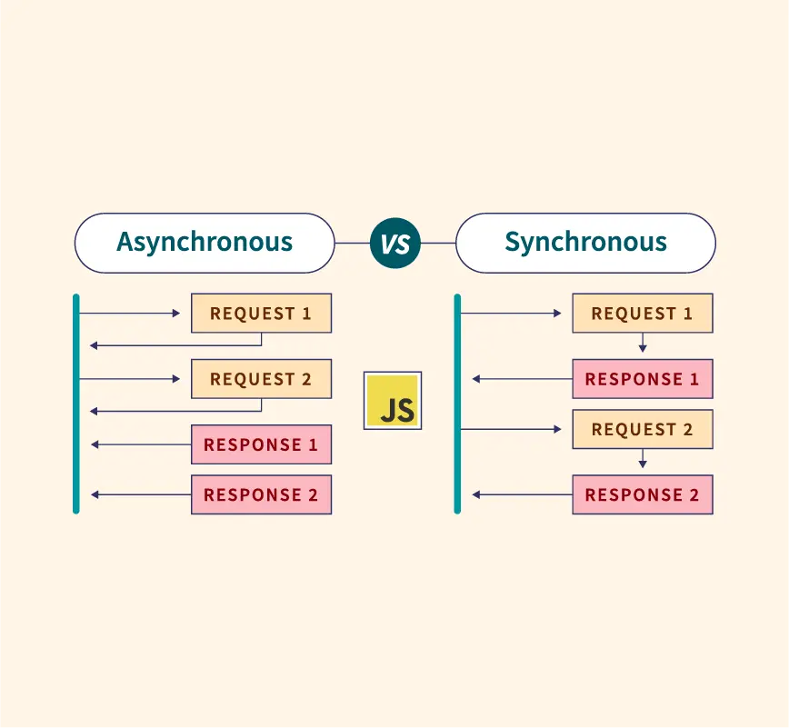

# What is  Synchronous ?

## Ин кодхо лайн ба лайн мерава. Аввал мебина коди бологи бе хатоги ба анчом расид, бад ба поён мегзара. Ай с++ то хозира мо чи коде навишта бдем хамаш ба синхронин кодхо дохил мешавад.Синхронин кодхо ажиданя надоранд.

# What is Asynchronous ?

## Ин кодхо мода дар оянда ягончи возврашать мекнан.3 рохи сохтани сохтани асинхронин кодхо мавчуд асть.

### 1: Calbacks
### 2: Promise
### 3: Async/await

# SetTimeout чист ?

## И методи асихронин кодхо аст ки 2 параметр мегира 1: calback , 2: time. Чанд сикунд пас аму логикамон сар шава, факат ябор мешава.

# SetInterval чист ?

## И методи асихронин кодхо аст ки 2 параметр мегира 1: calback , 2: time. И чанд сикунд пас сар шава бе охир рафтан мегира. Бо хастай break  ин хаст, clearInterval() и монанди брек мебошад.

# Promise ?

## 3 тарзи промис хаст:1:Pending, 2: Fulfilled(resolve), 3:Rejected. 
### Peending поиск мекна агар true бошад fulfilled ба мехалтад ва агар false бошад rejected ба мегалтад.